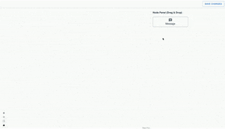

# Chat Flow Builder
- Create and customize chat flows
- Visualize chat flows
- Add or remove flows with ease
- Create intricate decision trees for seamless user interactions

## Host Link
[Chat Flow Builder](https://fascinating-sprinkles-e7ca9d.netlify.app/)

## Features

- Add/remove nodes and edges
  - Text Node 
- Edge validation
  - Only one source edge per node
- Update node data
  - Node text 
- Local storage persists on page refresh
- Drag and drop
- Zoom in/out

## Tech Stack
**Client:** React, TailwindCSS, MUI, React Flow

## Demo

## Reference
- [React](https://reactjs.org/)
- [React Flow](https://reactflow.dev/)
- [TailwindCSS](https://tailwindcss.com/)
- [Material UI](https://material-ui.com/)

